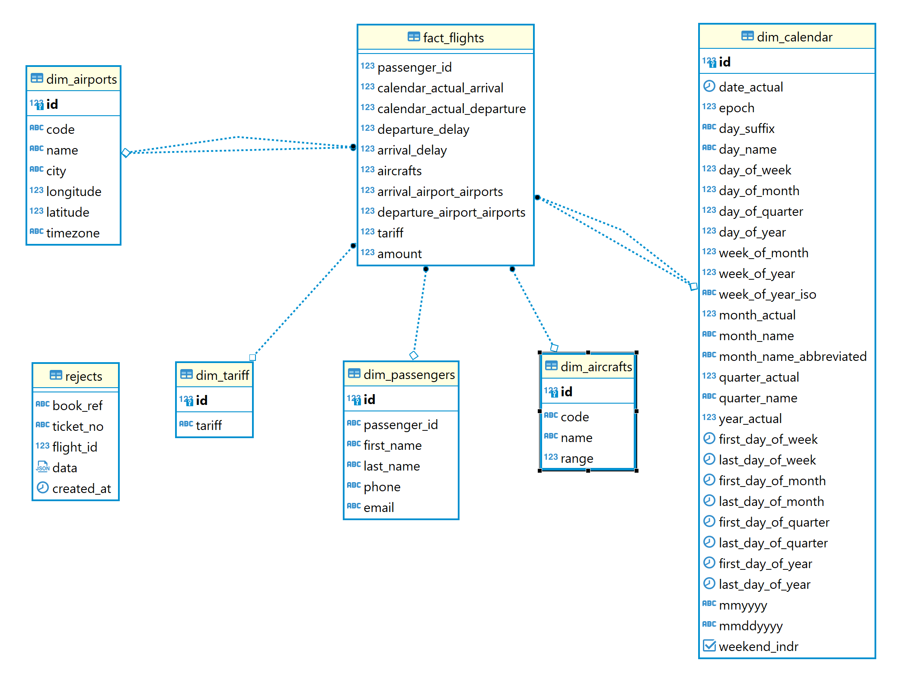
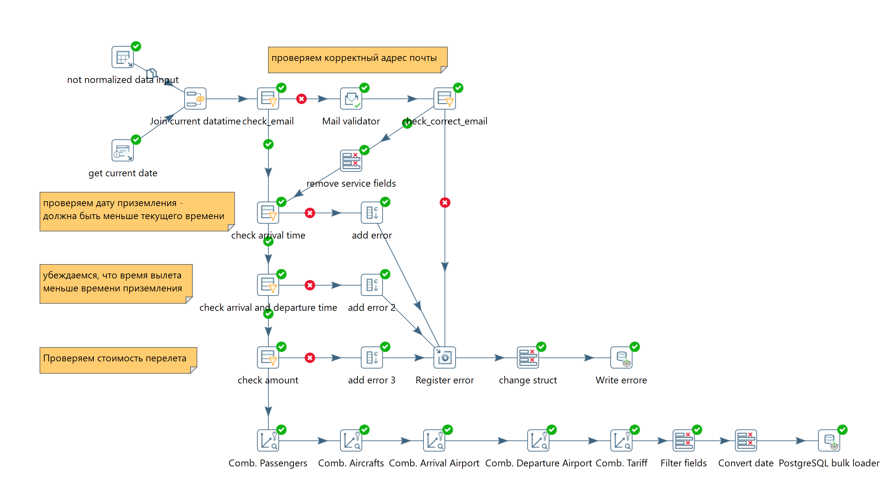

# Сдача промежуточного проекта DWH-8

## Состав файлов

* [create_tables.sql](create_tables.sql) sql скрипт для создания схемы и структуры таблиц
* [query.sql](query.sql) запрос, по которому получаем данные из БД demo.bookings
* readme.md текущий файл
* [Сдача промежуточного проекта.ktr](Сдача%20промежуточного%20проекта.ktr) файл трансформации для Pentaho DI
* docker-compose.yml файл конфигурации контейнера для запуска postgresql средствами docker-compose

## Структура DWH БД

## Опсиание ETL процесса

### Общий процессинг

1. На шаге "not normalized data input" получаем данные из БД demo.bookings, уже приведенные в денормализованннабор
   данных, с помощью [sql запроса](query.sql)
2. Шаг "get current date" позволяет получить текущие время и дату и добавить в общий поток на шаге объединения "Join
   current datatime"
3. На шаге "check_email" проверяем наличие знаяения в поле `passenger_email`, если поле не пусто - отправляем на шаг "
   Mail validator" для валидации,, после чего проверяем результат на шаге "check_correct_email" и если все хорошо,
   удаляем ненужние поля после шага валидации на этапе "remove service fields". В противном случае отправляем на
   регистрацию ошибок "Register error" (см. далее)
4. Этап "check arrival time" проверяет является ли дата приземления корректной: не больше текущей даты-времени. Если
   данные не валидны, на этапе "add error" насыщаем информацией об ошибке и отправляем на регистрацию ошибок "Register
   error"
5. Этап "check arrival and departure time" проверяет не перепутаны ли даты отправления и посадки. Так же насыщает
   данными об ошибке на этапе "add error 2" и отправляет на регистрацию ошибок "Register error" (см. далее)
6. "check amount" - на этом этапе проверяется стоимость перелета: больше или равно 0 (не знаю может ли быть равно нулю,
   но вдруг акция? =) ). Если данные не корректны, то на шаге "дополняются данные", ошибка уходит в регистр
7. Далее используя механизм `Combination Lookup/Update` заполняются справчники:
    * Dim_Passengers - справочник пассажиров
    * Dim_Aircrafts - справочник самолетов
    * Dim_Airports - справочник аэропортов
    * Dim_Tariff - справочник тарифов (Эконом/бизнес и тд)
      по следующему принципу: набор полей заносится в справочник и удаляется из потока данных
8. На шаге "Filter fields" выбираются из потока только необходимые поля для набора фактов
9. "Convert date" позволяет привести даты в вид индекса справочника Dim_Calendar (справочник дат), для последующей связи
10. Для записи фактов в таблицу "Fact_Flights" используется инструмент `PostgreSQL bulk loader`

### Регистрация ошибок "Register error"

Для упрощения журналирования ошибок была создана всего одна таблица "Rejects", в которой в качестве идентификатора
связанной строки используются ключи: book_ref, ticket_no, flight_id, а для хранения данных набор полей приводится в
JSON, и все это пишется в БД на этапе "Write errore"

